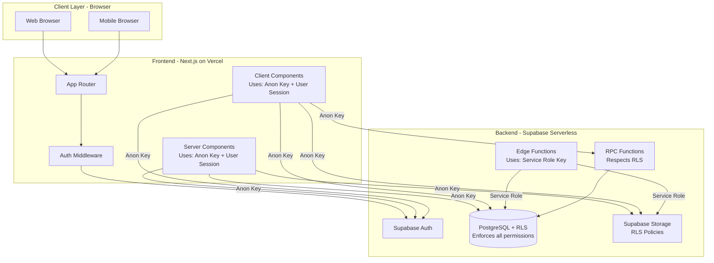
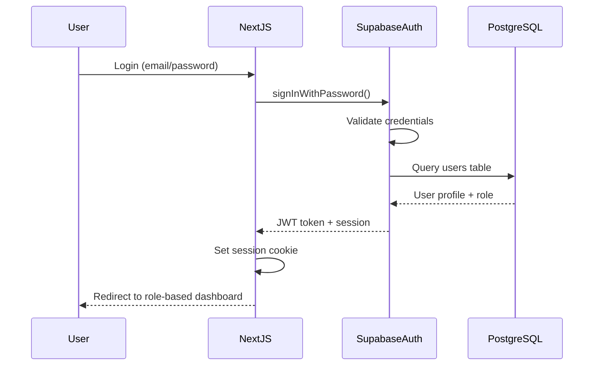

# Design Document

## Overview

The Solar CRM system is built on a fully serverless architecture using Next.js 14+ (App Router) for the frontend and Supabase as the complete backend-as-a-service platform. The system implements a multi-tenant, role-based access control model with five distinct user roles, with all permissions enforced at the database level through Row-Level Security (RLS) policies.

The architecture follows a two-tier serverless model:
1. **Frontend Layer**: Next.js React application (Client and Server Components) deployed on Vercel
2. **Backend Layer**: Supabase (PostgreSQL with RLS, Auth, Storage, Edge Functions)

Key architectural principles:
- **Security-first design**: All data access controlled by RLS policies at the database level - the frontend uses only the anon key
- **Fully serverless**: No backend servers to manage - Next.js serves as the frontend, Supabase handles all backend operations
- **RLS-enforced permissions**: User authentication and authorization enforced entirely through Supabase RLS policies
- **Direct-to-storage uploads**: Files uploaded directly to Supabase Storage using signed URLs generated by Edge Functions
- **Anon key only in frontend**: The Next.js application (including Server Components and API Routes) uses only the Supabase anon key with user sessions
- **Service role key isolation**: Service role key used only in Supabase Edge Functions and tests, never exposed to the frontend
- **Mobile-first responsive design**: Progressive Web App (PWA) capabilities for mobile users

## Architecture

### System Architecture Diagram



### Technology Stack

**Frontend:**
- Next.js 14+ (App Router, React Server Components)
- TypeScript for type safety
- Tailwind CSS for styling
- Shadcn/ui for component library
- React Hook Form for form management
- Zod for schema validation
- TanStack Query for data fetching and caching

**Backend:**
- Supabase Auth for authentication
- Supabase PostgreSQL for database
- Supabase Storage for file storage
- Supabase Edge Functions (Deno) for serverless functions
- Row-Level Security (RLS) for data access control

**Deployment:**
- Vercel for Next.js hosting
- Supabase Cloud for backend services
- GitHub for version control and CI/CD

### Authentication Flow



### Role-Based Access Control (RBAC)

The system implements RBAC primarily at the database level with frontend routing support:

1. **Database Level (Primary)**: RLS policies enforce all data access restrictions in PostgreSQL based on authenticated user's role
2. **Application Level (Secondary)**: Next.js middleware checks user role for UI routing and dashboard selection only

**Important Security Notes:**
- All security is enforced by RLS policies - the frontend cannot bypass these restrictions
- The Next.js application uses only the Supabase anon key with user authentication sessions
- User permissions are determined by their role stored in the users table
- RLS policies automatically filter data based on the authenticated user's role and ID

**Role Hierarchy:**
- Admin (superuser, RLS policies grant full access)
- Office Team (RLS policies grant access to all leads)
- Agent (RLS policies restrict to own leads only)
- Installer (RLS policies restrict to assigned installation leads only)
- Customer (RLS policies restrict to own linked lead only)

## Components and Interfaces

### Core Components

#### 1. Authentication Module

**Components:**
- `LoginForm`: Email/password authentication form
- `SignupForm`: Customer registration form
- `AuthProvider`: Context provider for auth state
- `ProtectedRoute`: HOC for route protection

**Interfaces:**
```typescript
interface User {
  id: string;
  email: string;
  name: string;
  phone: string;
  role: 'admin' | 'agent' | 'office' | 'installer' | 'customer';
  status: 'active' | 'disabled';
  created_at: string;
}

interface AuthSession {
  user: User;
  access_token: string;
  refresh_token: string;
  expires_at: number;
}
```

#### 2. Lead Management Module

**Components:**
- `LeadList`: Displays leads with filtering and search
- `LeadDetail`: Shows complete lead information
- `LeadForm`: Create/edit lead form
- `LeadStatusBadge`: Visual status indicator

**Interfaces:**
```typescript
interface Lead {
  id: string;
  customer_name: string;
  phone: string;
  email: string;
  address: string;
  kw_requirement: number;
  roof_type: string;
  notes: string;
  status: 'ongoing' | 'interested' | 'not_interested' | 'closed';
  created_by: string;
  customer_account_id: string | null;
  installer_id: string | null;
  source: 'agent' | 'office' | 'customer' | 'self';
  created_at: string;
  updated_at: string;
}

interface LeadFilters {
  search?: string;
  status?: Lead['status'][];
  dateFrom?: string;
  dateTo?: string;
  currentStep?: string;
  assignedTo?: string;
}
```

#### 3. Timeline Module

**Components:**
- `Timeline`: Main timeline display component
- `TimelineStep`: Individual step component
- `StepCompletionModal`: Modal for completing steps
- `StepMaster`: Admin interface for managing steps

**Interfaces:**
```typescript
interface StepMaster {
  id: string;
  step_name: string;
  order_index: number;
  allowed_roles: ('admin' | 'agent' | 'office' | 'installer' | 'customer')[];
  remarks_required: boolean;
  attachments_allowed: boolean;
  customer_upload: boolean;
  created_at: string;
}

interface LeadStep {
  id: string;
  lead_id: string;
  step_id: string;
  status: 'upcoming' | 'pending' | 'completed';
  completed_by: string | null;
  completed_at: string | null;
  remarks: string | null;
  attachments: string[];
  created_at: string;
  updated_at: string;
}

interface TimelineStepView {
  step: StepMaster;
  leadStep: LeadStep;
  canEdit: boolean;
  canComplete: boolean;
}
```

#### 4. Document Management Module

**Components:**
- `DocumentUploader`: File upload component with drag-and-drop
- `DocumentList`: Displays uploaded documents
- `DocumentViewer`: Preview documents
- `DocumentStatusBadge`: Shows document status

**Interfaces:**
```typescript
interface Document {
  id: string;
  lead_id: string;
  type: 'mandatory' | 'optional' | 'installation' | 'customer' | 'admin';
  document_category: 'aadhar_front' | 'aadhar_back' | 'bijli_bill' | 'bank_passbook' | 'cancelled_cheque' | 'pan_card' | 'itr' | 'other';
  file_path: string;
  file_name: string;
  file_size: number;
  mime_type: string;
  uploaded_by: string;
  status: 'valid' | 'corrupted' | 'replaced';
  uploaded_at: string;
}

interface SignedUploadUrl {
  uploadUrl: string;
  filePath: string;
  expiresAt: number;
}
```

#### 5. PM Suryaghar Form Module

**Components:**
- `PMSuryagharForm`: Multi-step form component
- `FormSection`: Reusable form section component
- `FormProgress`: Progress indicator

**Interfaces:**
```typescript
interface PMSuryagharForm {
  id: string;
  lead_id: string;
  applicant_name: string;
  applicant_phone: string;
  applicant_email: string;
  property_address: string;
  property_type: string;
  roof_type: string;
  roof_area: number;
  kw_requirement: number;
  aadhar_number: string;
  pan_number: string;
  bank_account_number: string;
  bank_ifsc: string;
  additional_data: Record<string, any>;
  submitted_by: string;
  submitted_at: string;
}
```

#### 6. Dashboard Module

**Components:**
- `AdminDashboard`: Admin overview with all metrics
- `OfficeDashboard`: Office team dashboard
- `AgentDashboard`: Agent-specific metrics
- `InstallerDashboard`: Installation tasks
- `CustomerDashboard`: Customer portal home
- `MetricCard`: Reusable metric display component
- `ChartComponent`: Data visualization

**Interfaces:**
```typescript
interface DashboardMetrics {
  totalLeads: number;
  leadsByStatus: Record<Lead['status'], number>;
  leadsByStep: Record<string, number>;
  conversionRate: number;
  pendingActions: number;
  recentActivity: ActivityLog[];
}
```

#### 7. Notification Module

**Components:**
- `NotificationBell`: Notification icon with count
- `NotificationList`: List of notifications
- `NotificationItem`: Individual notification

**Interfaces:**
```typescript
interface Notification {
  id: string;
  user_id: string;
  lead_id: string;
  type: 'step_completed' | 'document_corrupted' | 'remark_added' | 'lead_assigned';
  title: string;
  message: string;
  read: boolean;
  created_at: string;
}
```

### API Routes Structure

```
/api
  /auth
    /login - POST
    /signup - POST
    /logout - POST
  /leads
    / - GET, POST
    /[id] - GET, PATCH, DELETE
    /[id]/documents - GET, POST
    /[id]/documents/upload-url - POST
    /[id]/pm-suryaghar - GET, POST, PATCH
    /[id]/steps - GET
    /[id]/steps/[stepId]/complete - POST
    /[id]/steps/[stepId]/reopen - POST
    /[id]/activity - GET
  /steps
    / - GET, POST
    /[id] - PATCH, DELETE
    /reorder - PUT
  /users
    / - GET, POST
    /[id] - GET, PATCH, DELETE
  /dashboard
    /metrics - GET
  /notifications
    / - GET
    /[id]/read - PATCH
```

## Data Models

### Database Schema

#### users table
```sql
CREATE TABLE users (
  id UUID PRIMARY KEY DEFAULT gen_random_uuid(),
  email TEXT UNIQUE NOT NULL,
  name TEXT NOT NULL,
  phone TEXT UNIQUE NOT NULL,
  role TEXT NOT NULL CHECK (role IN ('admin', 'agent', 'office', 'installer', 'customer')),
  status TEXT NOT NULL DEFAULT 'active' CHECK (status IN ('active', 'disabled')),
  assigned_area TEXT,
  created_at TIMESTAMPTZ DEFAULT NOW(),
  updated_at TIMESTAMPTZ DEFAULT NOW()
);

CREATE INDEX idx_users_role ON users(role);
CREATE INDEX idx_users_phone ON users(phone);
```

#### leads table
```sql
CREATE TABLE leads (
  id UUID PRIMARY KEY DEFAULT gen_random_uuid(),
  customer_name TEXT NOT NULL,
  phone TEXT NOT NULL,
  email TEXT,
  address TEXT NOT NULL,
  kw_requirement NUMERIC(10, 2),
  roof_type TEXT,
  notes TEXT,
  status TEXT NOT NULL DEFAULT 'ongoing' CHECK (status IN ('ongoing', 'interested', 'not_interested', 'closed')),
  created_by UUID REFERENCES users(id),
  customer_account_id UUID REFERENCES users(id),
  installer_id UUID REFERENCES users(id),
  source TEXT NOT NULL CHECK (source IN ('agent', 'office', 'customer', 'self')),
  created_at TIMESTAMPTZ DEFAULT NOW(),
  updated_at TIMESTAMPTZ DEFAULT NOW()
);

CREATE INDEX idx_leads_created_by ON leads(created_by);
CREATE INDEX idx_leads_customer_account_id ON leads(customer_account_id);
CREATE INDEX idx_leads_installer_id ON leads(installer_id);
CREATE INDEX idx_leads_status ON leads(status);
CREATE INDEX idx_leads_phone ON leads(phone);
```

#### documents table
```sql
CREATE TABLE documents (
  id UUID PRIMARY KEY DEFAULT gen_random_uuid(),
  lead_id UUID NOT NULL REFERENCES leads(id) ON DELETE CASCADE,
  type TEXT NOT NULL CHECK (type IN ('mandatory', 'optional', 'installation', 'customer', 'admin')),
  document_category TEXT NOT NULL,
  file_path TEXT NOT NULL,
  file_name TEXT NOT NULL,
  file_size BIGINT NOT NULL,
  mime_type TEXT NOT NULL,
  uploaded_by UUID NOT NULL REFERENCES users(id),
  status TEXT NOT NULL DEFAULT 'valid' CHECK (status IN ('valid', 'corrupted', 'replaced')),
  uploaded_at TIMESTAMPTZ DEFAULT NOW()
);

CREATE INDEX idx_documents_lead_id ON documents(lead_id);
CREATE INDEX idx_documents_type ON documents(type);
CREATE INDEX idx_documents_status ON documents(status);
```

#### step_master table
```sql
CREATE TABLE step_master (
  id UUID PRIMARY KEY DEFAULT gen_random_uuid(),
  step_name TEXT NOT NULL,
  order_index INTEGER NOT NULL UNIQUE,
  allowed_roles TEXT[] NOT NULL,
  remarks_required BOOLEAN DEFAULT FALSE,
  attachments_allowed BOOLEAN DEFAULT FALSE,
  customer_upload BOOLEAN DEFAULT FALSE,
  created_at TIMESTAMPTZ DEFAULT NOW(),
  updated_at TIMESTAMPTZ DEFAULT NOW()
);

CREATE INDEX idx_step_master_order ON step_master(order_index);
```

#### lead_steps table
```sql
CREATE TABLE lead_steps (
  id UUID PRIMARY KEY DEFAULT gen_random_uuid(),
  lead_id UUID NOT NULL REFERENCES leads(id) ON DELETE CASCADE,
  step_id UUID NOT NULL REFERENCES step_master(id) ON DELETE CASCADE,
  status TEXT NOT NULL DEFAULT 'upcoming' CHECK (status IN ('upcoming', 'pending', 'completed')),
  completed_by UUID REFERENCES users(id),
  completed_at TIMESTAMPTZ,
  remarks TEXT,
  attachments TEXT[],
  created_at TIMESTAMPTZ DEFAULT NOW(),
  updated_at TIMESTAMPTZ DEFAULT NOW(),
  UNIQUE(lead_id, step_id)
);

CREATE INDEX idx_lead_steps_lead_id ON lead_steps(lead_id);
CREATE INDEX idx_lead_steps_step_id ON lead_steps(step_id);
CREATE INDEX idx_lead_steps_status ON lead_steps(status);
```

#### pm_suryaghar_form table
```sql
CREATE TABLE pm_suryaghar_form (
  id UUID PRIMARY KEY DEFAULT gen_random_uuid(),
  lead_id UUID NOT NULL UNIQUE REFERENCES leads(id) ON DELETE CASCADE,
  applicant_name TEXT NOT NULL,
  applicant_phone TEXT NOT NULL,
  applicant_email TEXT,
  property_address TEXT NOT NULL,
  property_type TEXT NOT NULL,
  roof_type TEXT NOT NULL,
  roof_area NUMERIC(10, 2),
  kw_requirement NUMERIC(10, 2) NOT NULL,
  aadhar_number TEXT NOT NULL,
  pan_number TEXT NOT NULL,
  bank_account_number TEXT NOT NULL,
  bank_ifsc TEXT NOT NULL,
  additional_data JSONB,
  submitted_by UUID NOT NULL REFERENCES users(id),
  submitted_at TIMESTAMPTZ DEFAULT NOW()
);

CREATE INDEX idx_pm_suryaghar_lead_id ON pm_suryaghar_form(lead_id);
```

#### activity_log table
```sql
CREATE TABLE activity_log (
  id UUID PRIMARY KEY DEFAULT gen_random_uuid(),
  lead_id UUID REFERENCES leads(id) ON DELETE CASCADE,
  user_id UUID NOT NULL REFERENCES users(id),
  action TEXT NOT NULL,
  entity_type TEXT NOT NULL,
  entity_id UUID,
  old_value JSONB,
  new_value JSONB,
  timestamp TIMESTAMPTZ DEFAULT NOW()
);

CREATE INDEX idx_activity_log_lead_id ON activity_log(lead_id);
CREATE INDEX idx_activity_log_user_id ON activity_log(user_id);
CREATE INDEX idx_activity_log_timestamp ON activity_log(timestamp DESC);
```

#### notifications table
```sql
CREATE TABLE notifications (
  id UUID PRIMARY KEY DEFAULT gen_random_uuid(),
  user_id UUID NOT NULL REFERENCES users(id) ON DELETE CASCADE,
  lead_id UUID REFERENCES leads(id) ON DELETE CASCADE,
  type TEXT NOT NULL,
  title TEXT NOT NULL,
  message TEXT NOT NULL,
  read BOOLEAN DEFAULT FALSE,
  created_at TIMESTAMPTZ DEFAULT NOW()
);

CREATE INDEX idx_notifications_user_id ON notifications(user_id);
CREATE INDEX idx_notifications_read ON notifications(read);
CREATE INDEX idx_notifications_created_at ON notifications(created_at DESC);
```

### Row-Level Security (RLS) Policies

#### leads table RLS

```sql
-- Enable RLS
ALTER TABLE leads ENABLE ROW LEVEL SECURITY;

-- Admin can see all leads
CREATE POLICY "Admin full access" ON leads
  FOR ALL
  USING (
    EXISTS (
      SELECT 1 FROM users
      WHERE users.id = auth.uid()
      AND users.role = 'admin'
    )
  );

-- Office can see all leads
CREATE POLICY "Office full access" ON leads
  FOR ALL
  USING (
    EXISTS (
      SELECT 1 FROM users
      WHERE users.id = auth.uid()
      AND users.role = 'office'
    )
  );

-- Agent can see only their own leads
CREATE POLICY "Agent own leads" ON leads
  FOR ALL
  USING (
    created_by = auth.uid()
    AND EXISTS (
      SELECT 1 FROM users
      WHERE users.id = auth.uid()
      AND users.role = 'agent'
    )
  );

-- Customer can see only their linked lead
CREATE POLICY "Customer own lead" ON leads
  FOR SELECT
  USING (
    customer_account_id = auth.uid()
    AND EXISTS (
      SELECT 1 FROM users
      WHERE users.id = auth.uid()
      AND users.role = 'customer'
    )
  );

-- Installer can see only assigned leads
CREATE POLICY "Installer assigned leads" ON leads
  FOR SELECT
  USING (
    installer_id = auth.uid()
    AND EXISTS (
      SELECT 1 FROM users
      WHERE users.id = auth.uid()
      AND users.role = 'installer'
    )
  );
```

#### documents table RLS

```sql
ALTER TABLE documents ENABLE ROW LEVEL SECURITY;

-- Admin can access all documents
CREATE POLICY "Admin full access" ON documents
  FOR ALL
  USING (
    EXISTS (
      SELECT 1 FROM users
      WHERE users.id = auth.uid()
      AND users.role = 'admin'
    )
  );

-- Office can access all documents
CREATE POLICY "Office full access" ON documents
  FOR ALL
  USING (
    EXISTS (
      SELECT 1 FROM users
      WHERE users.id = auth.uid()
      AND users.role = 'office'
    )
  );

-- Agent can access documents for their leads
CREATE POLICY "Agent own lead documents" ON documents
  FOR ALL
  USING (
    EXISTS (
      SELECT 1 FROM leads
      WHERE leads.id = documents.lead_id
      AND leads.created_by = auth.uid()
    )
    AND EXISTS (
      SELECT 1 FROM users
      WHERE users.id = auth.uid()
      AND users.role = 'agent'
    )
  );

-- Customer can access documents for their lead
CREATE POLICY "Customer own lead documents" ON documents
  FOR SELECT
  USING (
    EXISTS (
      SELECT 1 FROM leads
      WHERE leads.id = documents.lead_id
      AND leads.customer_account_id = auth.uid()
    )
    AND EXISTS (
      SELECT 1 FROM users
      WHERE users.id = auth.uid()
      AND users.role = 'customer'
    )
  );

-- Installer can access installation documents only
CREATE POLICY "Installer installation documents" ON documents
  FOR SELECT
  USING (
    type = 'installation'
    AND EXISTS (
      SELECT 1 FROM leads
      WHERE leads.id = documents.lead_id
      AND leads.installer_id = auth.uid()
    )
    AND EXISTS (
      SELECT 1 FROM users
      WHERE users.id = auth.uid()
      AND users.role = 'installer'
    )
  );
```

#### step_master table RLS

```sql
ALTER TABLE step_master ENABLE ROW LEVEL SECURITY;

-- Everyone can read step_master
CREATE POLICY "All users can read steps" ON step_master
  FOR SELECT
  USING (true);

-- Only admin can modify step_master
CREATE POLICY "Admin can modify steps" ON step_master
  FOR ALL
  USING (
    EXISTS (
      SELECT 1 FROM users
      WHERE users.id = auth.uid()
      AND users.role = 'admin'
    )
  );
```

### Supabase Storage Structure

```
Bucket: solar-projects (private)

Structure:
/leads/{lead_id}/mandatory/{uuid}.{ext}
/leads/{lead_id}/optional/{uuid}.{ext}
/leads/{lead_id}/installation/{uuid}.{ext}
/leads/{lead_id}/customer/{uuid}.{ext}
/leads/{lead_id}/admin/{uuid}.{ext}
```

**Storage Policies:**
```sql
-- Admin full access
CREATE POLICY "Admin full access"
ON storage.objects FOR ALL
USING (
  bucket_id = 'solar-projects'
  AND EXISTS (
    SELECT 1 FROM users
    WHERE users.id = auth.uid()
    AND users.role = 'admin'
  )
);

-- Office full access
CREATE POLICY "Office full access"
ON storage.objects FOR ALL
USING (
  bucket_id = 'solar-projects'
  AND EXISTS (
    SELECT 1 FROM users
    WHERE users.id = auth.uid()
    AND users.role = 'office'
  )
);

-- Agent can upload to their leads
CREATE POLICY "Agent upload own leads"
ON storage.objects FOR INSERT
WITH CHECK (
  bucket_id = 'solar-projects'
  AND EXISTS (
    SELECT 1 FROM leads
    WHERE leads.id::text = (string_to_array(name, '/'))[2]
    AND leads.created_by = auth.uid()
  )
  AND EXISTS (
    SELECT 1 FROM users
    WHERE users.id = auth.uid()
    AND users.role = 'agent'
  )
);

-- Customer can upload to their lead
CREATE POLICY "Customer upload own lead"
ON storage.objects FOR INSERT
WITH CHECK (
  bucket_id = 'solar-projects'
  AND (string_to_array(name, '/'))[3] = 'customer'
  AND EXISTS (
    SELECT 1 FROM leads
    WHERE leads.id::text = (string_to_array(name, '/'))[2]
    AND leads.customer_account_id = auth.uid()
  )
  AND EXISTS (
    SELECT 1 FROM users
    WHERE users.id = auth.uid()
    AND users.role = 'customer'
  )
);

-- Installer can upload installation files
CREATE POLICY "Installer upload installation"
ON storage.objects FOR INSERT
WITH CHECK (
  bucket_id = 'solar-projects'
  AND (string_to_array(name, '/'))[3] = 'installation'
  AND EXISTS (
    SELECT 1 FROM leads
    WHERE leads.id::text = (string_to_array(name, '/'))[2]
    AND leads.installer_id = auth.uid()
  )
  AND EXISTS (
    SELECT 1 FROM users
    WHERE users.id = auth.uid()
    AND users.role = 'installer'
  )
);
```


## Correctness Properties

*A property is a characteristic or behavior that should hold true across all valid executions of a system—essentially, a formal statement about what the system should do. Properties serve as the bridge between human-readable specifications and machine-verifiable correctness guarantees.*

### Property 1: Authentication Session Creation
*For any* user with valid credentials, authentication should succeed and return a session token with user profile data.
**Validates: Requirements 1.1**

### Property 2: Role Assignment Uniqueness
*For any* newly created user account, exactly one role from the valid role set should be assigned.
**Validates: Requirements 1.2**

### Property 3: Role-Based Dashboard Routing
*For any* authenticated user, the redirect URL after login should match the dashboard route corresponding to their assigned role.
**Validates: Requirements 1.3**

### Property 4: Disabled Account Authentication Block
*For any* user account with status 'disabled', authentication attempts should fail until the account is re-enabled.
**Validates: Requirements 1.4**

### Property 5: User Profile Data Persistence
*For any* user creation operation, all required profile fields (name, phone, email, role, status) should be persisted in the users table.
**Validates: Requirements 1.5**

### Property 6: Lead Creation Data Integrity
*For any* lead created by an Agent, all specified fields (name, phone, email, address, KW requirement, roof type, notes, created_by) should be recorded in the database.
**Validates: Requirements 2.1**

### Property 7: Initial Lead Status
*For any* newly created lead, the status field should be initialized to "ongoing".
**Validates: Requirements 2.2**

### Property 8: Automatic Status Transition to Interested
*For any* lead where all mandatory documents are uploaded and PM Suryaghar form is submitted, the lead status should automatically update to "interested".
**Validates: Requirements 2.3**

### Property 9: Agent Lead Visibility Restriction
*For any* Agent querying leads, the results should only include leads where created_by equals the Agent's user ID.
**Validates: Requirements 2.4**

### Property 10: Office and Admin Full Lead Access
*For any* Office Team or Admin user querying leads, the results should include all leads in the system.
**Validates: Requirements 2.5**

### Property 11: Customer Account and Profile Creation
*For any* customer registration with valid data, both a Supabase Auth account and a user profile record should be created.
**Validates: Requirements 3.1**

### Property 12: Lead Linking on Match
*For any* customer account creation where a lead with matching phone number exists, the lead's customer_account_id should be updated to link to the new customer account.
**Validates: Requirements 3.3**

### Property 13: Automatic Lead Creation for New Customers
*For any* customer registration where no matching lead exists, a new lead should be created with created_by set to the customer's user ID and source set to "self".
**Validates: Requirements 3.4**

### Property 14: Signed Upload URL Generation
*For any* document upload request, the system should return a valid signed URL with an expiration time.
**Validates: Requirements 4.1**

### Property 15: Document Storage Path Structure
*For any* uploaded document, the file path in storage should match the format: leads/{lead_id}/{type}/{uuid}.{extension}.
**Validates: Requirements 4.2**

### Property 16: Document Metadata Persistence
*For any* document upload, all metadata fields (lead_id, type, file_path, uploaded_by, status, uploaded_at) should be recorded in the documents table.
**Validates: Requirements 4.3**

### Property 17: Mandatory Document Validation
*For any* lead, validation should fail if any of the six mandatory documents (Aadhar Front, Aadhar Back, Bijli Bill, Bank Passbook, Cancelled Cheque, PAN Card) are missing.
**Validates: Requirements 4.4**

### Property 18: Corrupted Document Workflow Trigger
*For any* document marked as corrupted by Admin or Office, a re-upload notification or timeline step should be created.
**Validates: Requirements 4.5**

### Property 19: PM Suryaghar Form Data Persistence
*For any* PM Suryaghar form submission, the form data should be stored as JSON in the pm_suryaghar_form table.
**Validates: Requirements 5.1**

### Property 20: Form Submission Metadata Recording
*For any* PM Suryaghar form submission, the lead_id, submitted_by, and submitted_at fields should be recorded.
**Validates: Requirements 5.2**

### Property 21: Combined Status Transition
*For any* lead where PM Suryaghar form is submitted and all mandatory documents are uploaded, the lead status should update to "interested".
**Validates: Requirements 5.3**

### Property 22: Agent Form Submission Permission
*For any* Agent attempting to submit PM Suryaghar form, submission should only succeed for leads where created_by matches the Agent's user ID.
**Validates: Requirements 5.4**

### Property 23: Customer Form Submission Permission
*For any* Customer attempting to submit PM Suryaghar form, submission should only succeed for leads linked to that Customer's account.
**Validates: Requirements 5.5**

### Property 24: Step Master Data Integrity
*For any* step created in Step Master by Admin, all configuration fields (step_name, order_index, allowed_roles, remarks_required, attachments_allowed, customer_upload) should be persisted.
**Validates: Requirements 6.1**

### Property 25: Step Reordering Consistency
*For any* step reordering operation, the order_index values should be updated to reflect the new sequence without gaps or duplicates.
**Validates: Requirements 6.2**


### Property 26: Step Deletion Cascade
*For any* step deleted from Step Master, all associated lead_steps records should be updated or removed accordingly.
**Validates: Requirements 6.3**

### Property 27: Timeline Initialization on Lead Creation
*For any* newly created lead, lead_steps records should be initialized for all steps in Step Master with status "pending".
**Validates: Requirements 6.4**

### Property 28: Step Modification Permission Enforcement
*For any* user attempting to modify a step, the operation should only succeed if the user's role is in the step's allowed_roles array or the user is Admin.
**Validates: Requirements 6.5**

### Property 29: Step Completion Permission Validation
*For any* step completion attempt, the system should verify the user's role is in the step's allowed_roles array or the user is Admin before allowing completion.
**Validates: Requirements 7.1**

### Property 30: Step Completion Data Update
*For any* completed step, the lead_steps record should be updated with status "completed", completed_by user ID, completed_at timestamp, and optional remarks.
**Validates: Requirements 7.2**

### Property 31: Attachment Requirement Validation
*For any* step with attachments_allowed set to true, completion should be blocked until at least one document is uploaded.
**Validates: Requirements 7.3**

### Property 32: Remarks Requirement Validation
*For any* step with remarks_required set to true, completion should be blocked until remarks text is provided.
**Validates: Requirements 7.4**

### Property 33: Timeline Progression on Step Completion
*For any* completed step, if a next step exists with status "upcoming", its status should be updated to "pending".
**Validates: Requirements 7.5**

### Property 34: Agent RLS Lead Filtering
*For any* Agent querying the leads table, RLS policies should restrict results to leads where created_by equals the Agent's user ID.
**Validates: Requirements 8.1**

### Property 35: Customer RLS Lead Filtering
*For any* Customer querying the leads table, RLS policies should restrict results to leads where customer_account_id equals the Customer's user ID.
**Validates: Requirements 8.2**

### Property 36: Office and Admin RLS Full Access
*For any* Office Team or Admin user querying the leads table, RLS policies should allow access to all leads.
**Validates: Requirements 8.3**

### Property 37: Installer RLS Lead Filtering
*For any* Installer querying the leads table, RLS policies should restrict results to leads where installer_id equals the Installer's user ID.
**Validates: Requirements 8.4**

### Property 38: Step Master RLS Admin-Only Modification
*For any* user attempting to modify step_master table, RLS policies should only allow the operation if the user's role is 'admin'.
**Validates: Requirements 8.5**

### Property 39: Timeline Display Ordering
*For any* Customer viewing their timeline, steps should be displayed in order_index sequence from Step Master.
**Validates: Requirements 9.1**

### Property 40: Step Information Completeness
*For any* displayed timeline step, all required information (step name, status, completed_at, completed_by name, remarks) should be present in the rendered output.
**Validates: Requirements 9.2**

### Property 41: Customer Upload Button Conditional Display
*For any* step with customer_upload flag set to true and status "pending", an upload button should be displayed for the Customer.
**Validates: Requirements 9.3**

### Property 42: Installer Assignment Recording
*For any* installer assignment operation by Office Team, the installer_id should be recorded in the lead record.
**Validates: Requirements 10.1**

### Property 43: Installer Lead Visibility
*For any* Installer querying leads, only leads where installer_id matches the Installer's user ID should be displayed.
**Validates: Requirements 10.2**

### Property 44: Installer Upload Path Structure
*For any* installation photo uploaded by an Installer, the file should be stored under the path: leads/{lead_id}/installation/.
**Validates: Requirements 10.3**

### Property 45: Installer Step Completion
*For any* Installer marking an installation step complete, the lead_steps record for that step should be updated.
**Validates: Requirements 10.4**

### Property 46: Installer Data Access Restriction
*For any* Installer attempting to access PM Suryaghar form data, financial details, or survey information, access should be denied.
**Validates: Requirements 10.5**

### Property 47: Admin Permission Bypass
*For any* operation attempted by an Admin user, all role-based restrictions and RLS policies should be bypassed.
**Validates: Requirements 11.1**

### Property 48: Admin Complete Data Access
*For any* lead viewed by an Admin, all information including documents, forms, and timeline history should be accessible.
**Validates: Requirements 11.2**

### Property 49: Admin Step Modification Override
*For any* step modification attempted by Admin, the operation should succeed regardless of allowed_roles configuration.
**Validates: Requirements 11.3**

### Property 50: Admin Document Status Management
*For any* document status change by Admin, the document status should be updated and appropriate workflow actions should be triggered.
**Validates: Requirements 11.4**


### Property 51: Admin Timeline Manipulation Freedom
*For any* timeline manipulation by Admin (moving backward, skipping steps), lead_steps records should be updated without validation errors.
**Validates: Requirements 11.5**

### Property 52: Lead Operation Activity Logging
*For any* lead creation, update, or deletion operation, an activity_log entry should be created with user_id, action, timestamp, and changed fields.
**Validates: Requirements 12.1**

### Property 53: Document Operation Activity Logging
*For any* document upload or deletion operation, an activity_log entry should be created with document details.
**Validates: Requirements 12.2**

### Property 54: Step Operation Activity Logging
*For any* step completion or reopening operation, an activity_log entry should be created with step details and status change.
**Validates: Requirements 12.3**

### Property 55: Form Operation Activity Logging
*For any* PM Suryaghar form submission or modification, an activity_log entry should be created with form submission details.
**Validates: Requirements 12.4**

### Property 56: Activity Log Filtering
*For any* Admin viewing the activity log, filtering by lead, user, action type, and date range should return correctly filtered results.
**Validates: Requirements 12.5**

### Property 57: Document Corruption Status Update
*For any* document marked as corrupted by Office Team or Admin, the document status field should be updated to "corrupted".
**Validates: Requirements 13.1**

### Property 58: Corruption Notification Creation
*For any* document marked as corrupted, a notification or timeline step requiring re-upload should be created.
**Validates: Requirements 13.2**

### Property 59: Customer Corruption Notification
*For any* document uploaded by Customer and marked as corrupted, the Customer should receive a notification and see an upload button in their portal.
**Validates: Requirements 13.3**

### Property 60: Agent Corruption Notification
*For any* document uploaded by Agent and marked as corrupted, the Agent should receive a notification and be allowed to re-upload.
**Validates: Requirements 13.4**

### Property 61: Document Replacement Workflow
*For any* replacement document uploaded, the original document status should be updated to "replaced" and a new document record should be created.
**Validates: Requirements 13.5**

### Property 62: Payment Step Completion
*For any* payment marked as received by Office Team, the corresponding timeline step should be updated to completed with payment details in remarks.
**Validates: Requirements 14.1**

### Property 63: Loan Step Creation
*For any* loan option selected by Office Team, loan-specific timeline steps for application and approval should be created.
**Validates: Requirements 14.2**

### Property 64: Installation Step Enablement After Payment
*For any* payment or loan step completion, the installation scheduling step should become enabled.
**Validates: Requirements 14.3**

### Property 65: Payment Data Persistence
*For any* payment recorded, payment amount, date, method, and transaction reference should be stored in step remarks or dedicated fields.
**Validates: Requirements 14.4**

### Property 66: Payment Status Display Without Sensitive Data
*For any* Customer viewing timeline with payment information, payment status should be displayed without exposing sensitive financial details.
**Validates: Requirements 14.5**

### Property 67: Net Meter Step Enablement
*For any* installation completion, the net meter application step should become enabled.
**Validates: Requirements 15.1**

### Property 68: Net Meter Application Data Recording
*For any* net meter application submitted by Office Team, the timeline step should be updated with application reference number and submission date.
**Validates: Requirements 15.2**

### Property 69: Subsidy Step Enablement
*For any* commissioning completion, the subsidy submission step should become enabled.
**Validates: Requirements 15.3**

### Property 70: Subsidy Application Data Recording
*For any* subsidy application submitted by Office Team, the timeline step should be updated with subsidy amount and application details.
**Validates: Requirements 15.4**

### Property 71: Project Closure Enablement After Subsidy
*For any* subsidy release, the subsidy step should be marked complete and the project closure step should become enabled.
**Validates: Requirements 15.5**

### Property 72: Closure Step Enablement Logic
*For any* lead where all mandatory timeline steps are completed, the project closure step should become enabled.
**Validates: Requirements 16.1**

### Property 73: Lead Status Update on Closure
*For any* project marked as closed by Office Team or Admin, the lead status should be updated to "Closed".
**Validates: Requirements 16.2**

### Property 74: Closure Metadata Recording
*For any* project closure, closure date, closed_by user ID, and final remarks should be recorded.
**Validates: Requirements 16.3**

### Property 75: Closed Project Immutability
*For any* closed project, timeline step modifications should be prevented unless the project is reopened by Admin.
**Validates: Requirements 16.4**

### Property 76: Project Reopening
*For any* closed project reopened by Admin, the lead status should update to "Ongoing" and step modifications should be allowed.
**Validates: Requirements 16.5**

### Property 77: Dashboard Metrics Calculation
*For any* Office Team or Admin viewing the dashboard, total leads count, leads by status, and leads by current timeline step should be displayed with correct values.
**Validates: Requirements 17.1**

### Property 78: Agent Dashboard Filtering
*For any* Agent viewing the dashboard, statistics should only include the Agent's own leads.
**Validates: Requirements 17.2**

### Property 79: Conversion Rate Calculation
*For any* dashboard load, conversion rates from Ongoing to Interested to Closed should be calculated and displayed correctly.
**Validates: Requirements 17.3**

### Property 80: Pending Actions Count
*For any* dashboard load, the pending actions count should accurately reflect incomplete steps and missing documents.
**Validates: Requirements 17.4**


### Property 81: Dashboard Filter Functionality
*For any* dashboard filter applied (date range, lead status, assigned user, timeline step), the results should be correctly filtered.
**Validates: Requirements 17.5**

### Property 82: Multi-Field Search
*For any* search text entered, leads matching the term in name, phone, email, or address fields should be returned.
**Validates: Requirements 18.1**

### Property 83: Status Filter Application
*For any* status filter applied, only leads with matching status values should be displayed.
**Validates: Requirements 18.2**

### Property 84: Date Range Filter Application
*For any* date range filter applied, only leads created within the specified range should be displayed.
**Validates: Requirements 18.3**

### Property 85: Timeline Step Filter Application
*For any* timeline step filter applied, only leads currently at the selected step should be displayed.
**Validates: Requirements 18.4**

### Property 86: Combined Filter Logic
*For any* combination of multiple filters, results should match all criteria using AND logic and display the correct result count.
**Validates: Requirements 18.5**

### Property 87: Step Completion Notification Creation
*For any* timeline step completed for a Customer's lead, a notification record should be created for that Customer.
**Validates: Requirements 19.1**

### Property 88: Document Corruption Notification Creation
*For any* document marked as corrupted, a notification should be created for the Customer requesting re-upload.
**Validates: Requirements 19.2**

### Property 89: Remarks Notification Creation
*For any* remarks added to a step by Office Team, a notification should be created for the Customer with the remarks content.
**Validates: Requirements 19.3**

### Property 90: Notification Display on Login
*For any* Customer login, unread notifications count and notification list should be displayed.
**Validates: Requirements 19.4**

### Property 91: Notification Read Status Update
*For any* notification viewed by a Customer, the notification should be marked as read.
**Validates: Requirements 19.5**

## Error Handling

### Authentication Errors
- **Invalid Credentials**: Return 401 Unauthorized with clear error message
- **Disabled Account**: Return 403 Forbidden with account status message
- **Session Expired**: Return 401 and redirect to login with session expiry message
- **Missing Auth Token**: Return 401 and redirect to login

### Authorization Errors
- **Insufficient Permissions**: Return 403 Forbidden with permission requirement message
- **RLS Policy Violation**: Return 403 with data access restriction message
- **Role Mismatch**: Return 403 with role requirement message

### Validation Errors
- **Missing Required Fields**: Return 400 Bad Request with list of missing fields
- **Invalid Data Format**: Return 400 with format specification
- **Constraint Violations**: Return 400 with constraint details
- **File Size Exceeded**: Return 413 Payload Too Large with size limit
- **Invalid File Type**: Return 400 with allowed file types

### Business Logic Errors
- **Mandatory Documents Missing**: Return 422 Unprocessable Entity with list of missing documents
- **Step Prerequisites Not Met**: Return 422 with prerequisite requirements
- **Lead Already Linked**: Return 409 Conflict with existing link details
- **Step Already Completed**: Return 409 with completion details
- **Invalid Status Transition**: Return 422 with valid transition options

### Database Errors
- **Connection Failure**: Return 503 Service Unavailable with retry message
- **Query Timeout**: Return 504 Gateway Timeout with retry suggestion
- **Unique Constraint Violation**: Return 409 Conflict with duplicate field details
- **Foreign Key Violation**: Return 400 with relationship requirement
- **Transaction Rollback**: Return 500 Internal Server Error with transaction details

### Storage Errors
- **Upload Failure**: Return 500 with retry instructions
- **Signed URL Expired**: Return 410 Gone with new URL generation prompt
- **Storage Quota Exceeded**: Return 507 Insufficient Storage with quota details
- **File Not Found**: Return 404 Not Found with file path

### Error Response Format
All errors follow a consistent JSON structure:
```typescript
interface ErrorResponse {
  error: {
    code: string;
    message: string;
    details?: Record<string, any>;
    timestamp: string;
  };
}
```

### Error Logging
- All errors logged to activity_log table with context
- Critical errors trigger admin notifications
- Error patterns monitored for system health
- User-facing errors sanitized to prevent information leakage

## Testing Strategy

### Unit Testing
Unit tests will verify individual functions and components in isolation:

**Authentication Module:**
- Test credential validation logic
- Test session token generation
- Test role assignment logic
- Test account status checks

**Lead Management:**
- Test lead creation with various input combinations
- Test lead status transitions
- Test lead filtering by role
- Test lead search functionality

**Document Management:**
- Test signed URL generation
- Test file path construction
- Test document metadata recording
- Test mandatory document validation

**Timeline Engine:**
- Test step initialization on lead creation
- Test step completion validation
- Test timeline progression logic
- Test step reordering

**Form Handling:**
- Test PM Suryaghar form validation
- Test form data serialization
- Test form submission permissions

### Property-Based Testing
Property-based tests will verify universal properties across all inputs using **fast-check** (JavaScript/TypeScript property testing library). Each property-based test will run a minimum of 100 iterations with randomly generated inputs.

**Configuration:**
```typescript
import fc from 'fast-check';

// Configure to run 100 iterations per property
fc.configureGlobal({ numRuns: 100 });
```

**Property Test Examples:**

**Property 1: Authentication Session Creation**
```typescript
// Feature: solar-crm, Property 1: Authentication Session Creation
fc.assert(
  fc.property(
    fc.record({
      email: fc.emailAddress(),
      password: fc.string({ minLength: 8 }),
      role: fc.constantFrom('admin', 'agent', 'office', 'installer', 'customer')
    }),
    async (validUser) => {
      const session = await authenticate(validUser.email, validUser.password);
      expect(session).toBeDefined();
      expect(session.access_token).toBeDefined();
      expect(session.user.role).toBe(validUser.role);
    }
  )
);
```

**Property 8: Automatic Status Transition to Interested**
```typescript
// Feature: solar-crm, Property 8: Automatic Status Transition to Interested
fc.assert(
  fc.property(
    fc.record({
      leadId: fc.uuid(),
      mandatoryDocs: fc.constant(['aadhar_front', 'aadhar_back', 'bijli_bill', 'bank_passbook', 'cancelled_cheque', 'pan_card']),
      pmFormData: fc.record({ /* form fields */ })
    }),
    async (testData) => {
      // Upload all mandatory documents
      for (const docType of testData.mandatoryDocs) {
        await uploadDocument(testData.leadId, docType);
      }
      // Submit PM Suryaghar form
      await submitPMForm(testData.leadId, testData.pmFormData);
      
      // Verify status changed to interested
      const lead = await getLead(testData.leadId);
      expect(lead.status).toBe('interested');
    }
  )
);
```

**Property 27: Timeline Initialization on Lead Creation**
```typescript
// Feature: solar-crm, Property 27: Timeline Initialization on Lead Creation
fc.assert(
  fc.property(
    fc.record({
      customer_name: fc.string({ minLength: 1 }),
      phone: fc.string({ minLength: 10, maxLength: 15 }),
      email: fc.emailAddress(),
      address: fc.string({ minLength: 5 })
    }),
    async (leadData) => {
      const stepMasterSteps = await getStepMaster();
      const lead = await createLead(leadData);
      const leadSteps = await getLeadSteps(lead.id);
      
      // Verify lead_steps created for all step_master steps
      expect(leadSteps.length).toBe(stepMasterSteps.length);
      leadSteps.forEach(ls => {
        expect(ls.status).toBe('pending');
      });
    }
  )
);
```

**Property 34: Agent RLS Lead Filtering**
```typescript
// Feature: solar-crm, Property 34: Agent RLS Lead Filtering
fc.assert(
  fc.property(
    fc.array(fc.record({
      id: fc.uuid(),
      created_by: fc.uuid()
    }), { minLength: 5, maxLength: 20 }),
    fc.uuid(), // agentId
    async (allLeads, agentId) => {
      // Create leads in database
      await Promise.all(allLeads.map(l => createLead(l)));
      
      // Query as agent
      const agentLeads = await queryLeadsAsAgent(agentId);
      
      // Verify only agent's leads returned
      agentLeads.forEach(lead => {
        expect(lead.created_by).toBe(agentId);
      });
    }
  )
);
```

### Integration Testing
Integration tests will verify interactions between components:

- Test complete lead creation flow from UI to database
- Test document upload flow with signed URLs
- Test timeline progression through multiple steps
- Test customer registration and lead linking
- Test role-based access across multiple components
- Test notification creation and delivery
- Test activity logging across operations

### End-to-End Testing
E2E tests will verify complete user workflows:

- Agent creates lead, uploads documents, submits PM form
- Customer registers, links to lead, views timeline
- Office team processes lead through all steps
- Installer completes installation tasks
- Admin manages step master and overrides permissions

### Testing Tools
- **Jest**: Unit testing framework
- **fast-check**: Property-based testing library
- **React Testing Library**: Component testing
- **Playwright**: E2E testing
- **Supabase Test Helpers**: Database testing utilities

## Deployment and Operations

### Deployment Architecture

**Frontend Deployment (Vercel):**
- Automatic deployments from main branch
- Preview deployments for pull requests
- Edge network distribution for low latency
- Automatic HTTPS and custom domain support

**Backend Deployment (Supabase):**
- Managed PostgreSQL with automatic backups
- Automatic scaling based on load
- Built-in monitoring and logging
- Database migrations via Supabase CLI

### Environment Configuration

**Development:**
- Local Supabase instance via Docker
- Next.js development server
- Hot module replacement
- Debug logging enabled

**Staging:**
- Supabase staging project
- Vercel preview deployment
- Production-like data (anonymized)
- Integration testing enabled

**Production:**
- Supabase production project
- Vercel production deployment
- Real user data
- Error tracking and monitoring

### Database Migrations

Migrations managed via Supabase CLI:
```bash
# Create new migration
supabase migration new migration_name

# Apply migrations
supabase db push

# Rollback migration
supabase db reset
```

### Monitoring and Observability

**Application Monitoring:**
- Vercel Analytics for performance metrics
- Error tracking via Sentry
- Custom logging to activity_log table
- Real-time alerts for critical errors

**Database Monitoring:**
- Supabase Dashboard for query performance
- Connection pool monitoring
- Slow query identification
- Storage usage tracking

**Security Monitoring:**
- Failed authentication attempts tracking
- RLS policy violation logging
- Unusual access pattern detection
- Admin action audit trail

### Backup and Recovery

**Database Backups:**
- Automatic daily backups via Supabase
- Point-in-time recovery capability
- Backup retention: 30 days
- Manual backup before major changes

**Storage Backups:**
- Supabase Storage automatic replication
- Manual export for critical documents
- Disaster recovery plan documented

### Performance Optimization

**Database Optimization:**
- Indexes on frequently queried columns
- Query optimization for complex joins
- Connection pooling configuration
- Materialized views for dashboard metrics

**Frontend Optimization:**
- Server-side rendering for initial load
- Code splitting and lazy loading
- Image optimization via Next.js
- CDN caching for static assets

**Storage Optimization:**
- Image compression before upload
- File size limits enforcement
- Signed URL caching
- Lazy loading for document lists

### Security Measures

**Application Security:**
- HTTPS enforcement
- CSRF protection
- XSS prevention via React
- Content Security Policy headers

**Database Security:**
- RLS policies on all tables
- Prepared statements to prevent SQL injection
- Encrypted connections
- Regular security audits

**Storage Security:**
- Private bucket configuration
- Signed URLs with expiration
- File type validation
- Virus scanning for uploads

### Scalability Considerations

**Horizontal Scaling:**
- Vercel automatic scaling for frontend
- Supabase connection pooling
- Edge function distribution
- CDN for static content

**Vertical Scaling:**
- Database instance upgrades as needed
- Storage capacity monitoring
- Connection limit adjustments

**Performance Targets:**
- Page load time: < 2 seconds
- API response time: < 500ms
- Document upload: < 5 seconds for 5MB file
- Dashboard load: < 1 second

